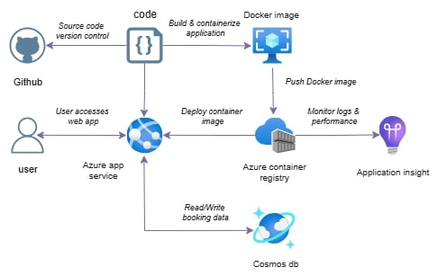
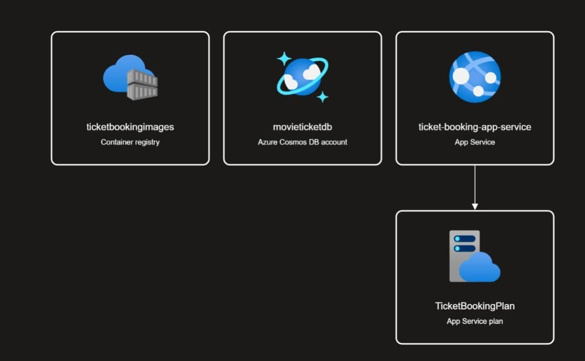
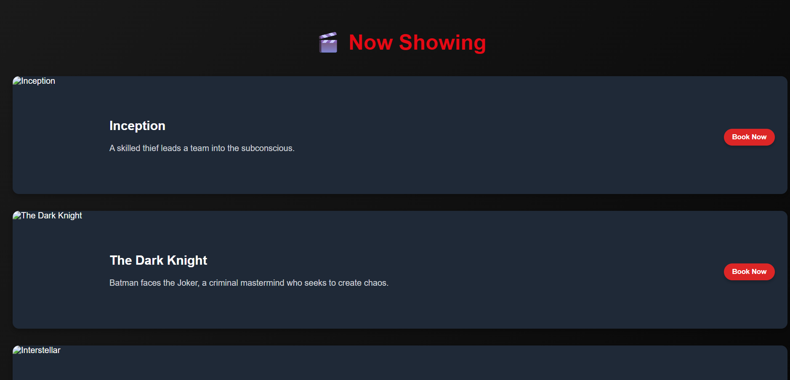
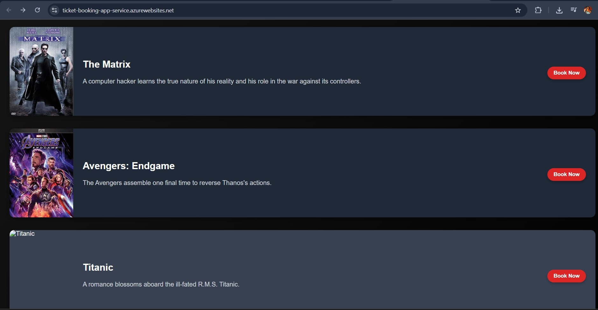
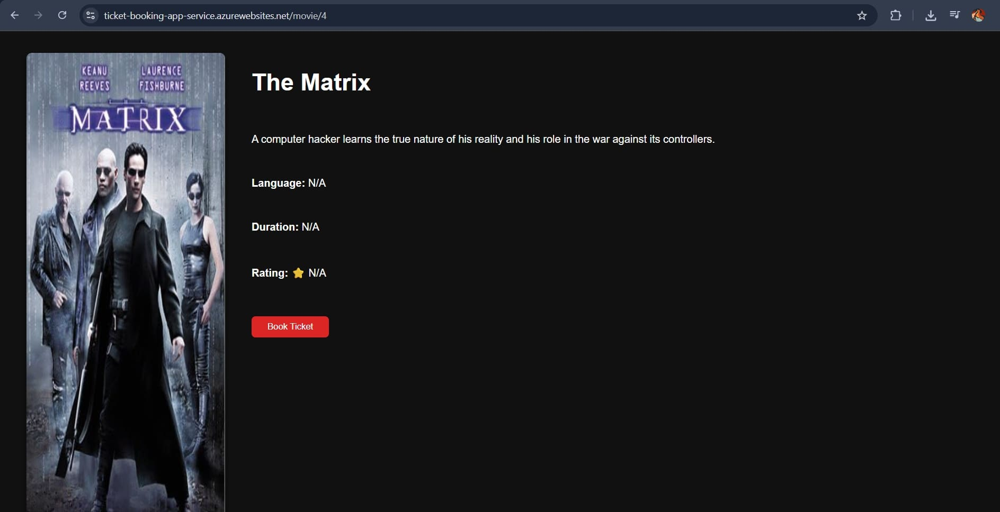
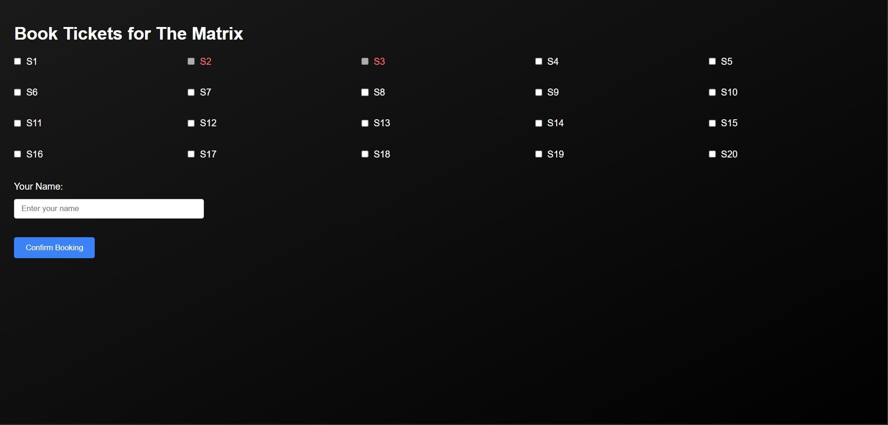
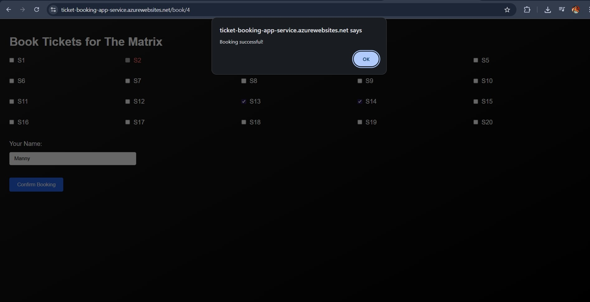
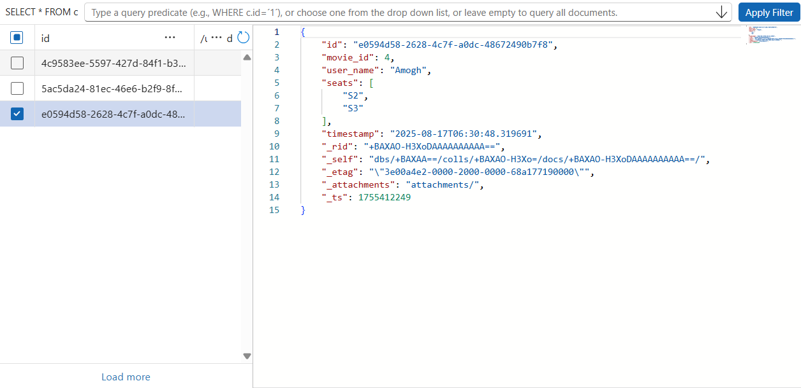

# Movie Ticket Booking System

A **cloud-native movie ticket booking platform** built with:

- **Frontend:** React (Vite), Axios, React Router
- **Backend:** FastAPI (Python)
- **Database:** Azure Cosmos DB
- **Containerization:** Docker
- **Deployment:** Azure App Service (Linux, Docker) with Azure Container Registry
- **Monitoring:** Azure Application Insights

This project demonstrates **full-stack development + cloud deployment on Azure**, covering frontend, backend, database integration, CI/CD, and observability.

---

## Features

- Browse movies and see details
- Seat selection with real-time availability check
- Book tickets by entering your name
- Persistent data stored in **Cosmos DB**
- Deployment using **Azure App Service + ACR**
- Integrated **Application Insights** for monitoring

---

## Architecture





### Workflow:

1. Code is pushed to **GitHub**
2. A **Docker Image** is built containing both frontend + backend
3. Image is pushed to **Azure Container Registry (ACR)**
4. **Azure App Service** pulls the container image and serves the app
5. App communicates with **Cosmos DB** for persistence
6. **Application Insights** monitors logs, metrics, and telemetry

---

## Tech Stack

- **Frontend:** React (Vite), TailwindCSS, Axios
- **Backend:** FastAPI (Python), Uvicorn
- **Database:** Azure Cosmos DB
- **Deployment:** Docker + Azure App Service + ACR
- **Monitoring:** Azure Application Insights

---

## Getting Started (Local Development)

* Backend: cd backend
  pip install -r requirements.txt
  uvicorn app.main:app --reload --host 0.0.0.0 --port 8000
* Frontend:cd frontend
  npm install
  npm run dev

---

## Screenshots:











### Clone the Repository
```bash
git clone https://github.com/Amogh052003/Movie_ticket_booking.git
cd Movie_ticket_booking
```
